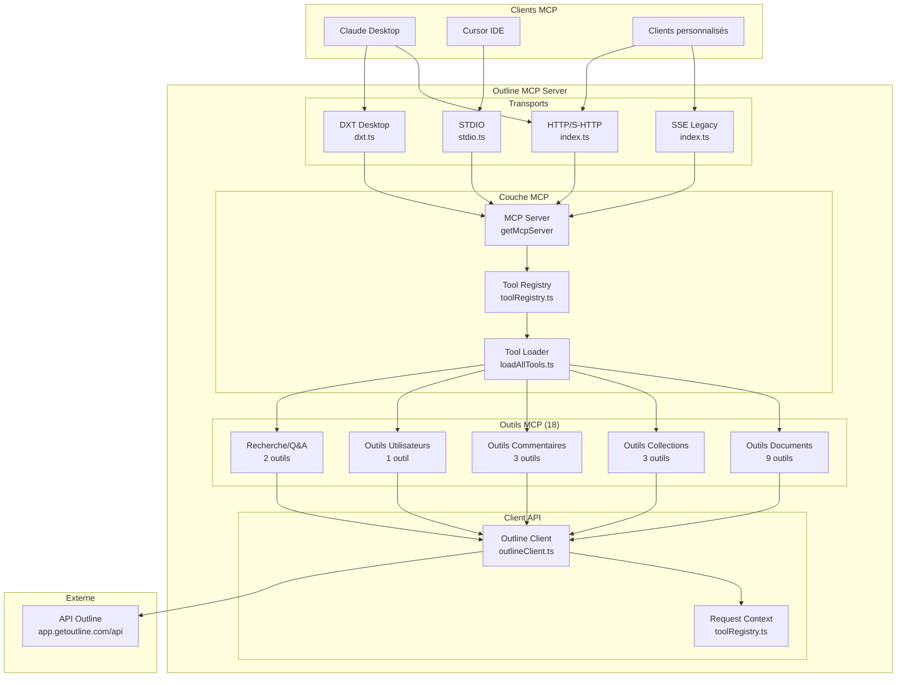
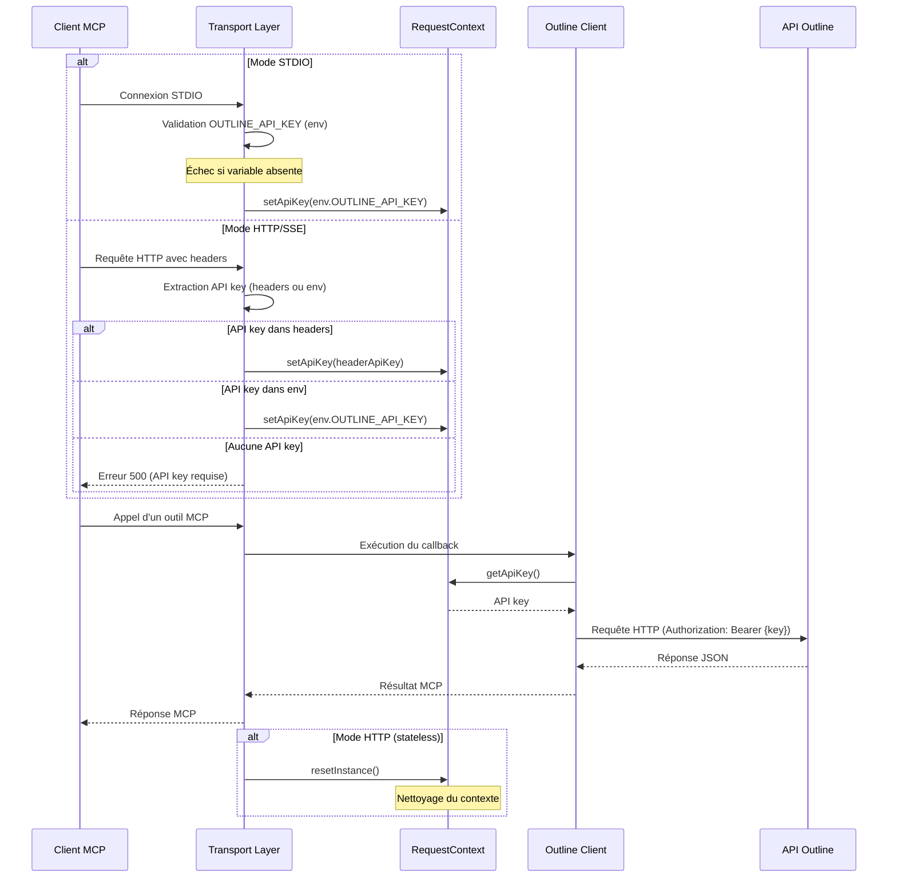
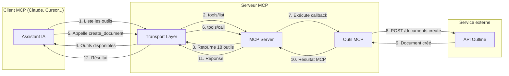

# Architecture

Ce document décrit l'architecture globale du serveur Outline MCP, ses composants principaux et leurs interactions.

## Vue d'ensemble

Outline MCP Server est un serveur TypeScript/Node.js qui implémente le protocole MCP (Model Context Protocol) d'Anthropic. Il agit comme un pont entre les assistants IA (comme Claude) et l'API Outline, exposant des fonctionnalités de gestion de documents, collections, commentaires et utilisateurs.

### Rôle du serveur

Le serveur MCP :
1. **Expose des outils** : 18 outils MCP permettant d'interagir avec Outline
2. **Authentifie les requêtes** : Gère l'authentification auprès de l'API Outline via des clés API
3. **Transporte les messages** : Supporte plusieurs protocoles de transport (HTTP, SSE, STDIO)
4. **Transforme les données** : Convertit les requêtes MCP en appels API Outline et vice-versa

---

## Architecture globale



---

## Points d'entrée

Le serveur possède **trois points d'entrée principaux** selon le mode d'utilisation :

### 1. Mode HTTP/SSE (`src/index.ts`)

**Fichier** : `/src/index.ts`
**Binaire** : `outline-mcp-server` (défini dans package.json)
**Usage** : Serveur HTTP Fastify pour les clients MCP distants

**Protocoles supportés** :
- **Streamable HTTP (S-HTTP)** : Protocole MCP moderne recommandé
  - Endpoint : `POST /mcp`
  - Mode stateless (recommandé)
- **SSE (Server-Sent Events)** : Protocole MCP legacy déprecié
  - Endpoint : `GET /sse` + `POST /messages`

**Configuration** :
- Port : `OUTLINE_MCP_PORT` (défaut : 6060)
- Host : `OUTLINE_MCP_HOST` (défaut : 127.0.0.1)

**Authentification** :
- Via headers de requête (recommandé)
- Via variable d'environnement (fallback)

### 2. Mode STDIO (`src/stdio.ts`)

**Fichier** : `/src/stdio.ts`
**Binaire** : `outline-mcp-server-stdio` (défini dans package.json)
**Usage** : Communication directe via stdin/stdout pour les clients locaux (Cursor, etc.)

**Caractéristiques** :
- Communication synchrone via flux standards Unix
- Nécessite obligatoirement `OUTLINE_API_KEY` en variable d'environnement
- Pas de serveur HTTP, connexion directe
- Utilisé par les IDE comme Cursor

**Validation** : L'API key est validée au démarrage, le serveur refuse de démarrer si elle est absente.

### 3. Mode DXT (`src/dxt.ts`)

**Fichier** : `/src/dxt.ts`
**Binaire** : Build spécial via `npm run build:dxt`
**Usage** : Extension desktop pour Claude Desktop (format .dxt)

**Caractéristiques** :
- Utilise STDIO sous le capot
- Packagé en fichier .dxt pour installation facile
- Gestion avancée des erreurs (uncaught exceptions, SIGTERM, etc.)
- Logger dédié (stderr uniquement pour respecter la spec MCP)

---

## Structure du code source

```
outline-mcp-server/
├── src/
│   ├── index.ts              # Point d'entrée HTTP/SSE
│   ├── stdio.ts              # Point d'entrée STDIO
│   ├── dxt.ts                # Point d'entrée DXT Desktop
│   │
│   ├── outline/
│   │   └── outlineClient.ts  # Client HTTP pour API Outline
│   │
│   ├── tools/                # 18 outils MCP
│   │   ├── archiveDocument.ts
│   │   ├── askDocuments.ts
│   │   ├── createCollection.ts
│   │   ├── createComment.ts
│   │   ├── createDocument.ts
│   │   ├── createTemplateFromDocument.ts
│   │   ├── deleteComment.ts
│   │   ├── deleteDocument.ts
│   │   ├── getCollection.ts
│   │   ├── getDocument.ts
│   │   ├── listCollections.ts
│   │   ├── listDocuments.ts
│   │   ├── listUsers.ts
│   │   ├── moveDocument.ts
│   │   ├── searchDocuments.ts
│   │   ├── updateCollection.ts
│   │   ├── updateComment.ts
│   │   └── updateDocument.ts
│   │
│   └── utils/
│       ├── getMcpServer.ts   # Factory pour créer un serveur MCP
│       ├── loadAllTools.ts   # Chargeur dynamique d'outils
│       ├── logger.ts         # Logger simple (stderr)
│       └── toolRegistry.ts   # Registre global d'outils + contexte
│
├── scripts/                  # Scripts de build et génération
│   ├── build-dxt.sh         # Build de l'extension DXT
│   ├── generate-dxt-manifest.js
│   └── build-all-assets.js  # Appelé par semantic-release
│
├── .github/workflows/        # CI/CD
│   ├── npm-publish-and-release.yml
│   └── publish-to-ghcr.yml
│
├── build/                    # Sortie de compilation TypeScript
├── dist/                     # Build DXT temporaire
└── docs/                     # Documentation technique (ce répertoire)
```

---

## Dépendances principales

### Dépendances de production

| Package | Version | Rôle |
|---------|---------|------|
| `@modelcontextprotocol/sdk` | 1.13.1 | SDK MCP officiel d'Anthropic pour créer des serveurs MCP |
| `axios` | 1.10.0 | Client HTTP pour communiquer avec l'API Outline |
| `fastify` | 5.4.0 | Serveur HTTP léger et performant pour le mode HTTP/SSE |
| `zod` | 3.25.67 | Validation et typage des schémas d'entrée/sortie des outils |
| `dotenv` | 16.5.0 | Chargement des variables d'environnement depuis .env |
| `omit-ts` | 2.0.1 | Utilitaire TypeScript pour filtrer des propriétés |

### Dépendances de développement

| Package | Version | Rôle |
|---------|---------|------|
| `typescript` | 5.x | Compilateur TypeScript |
| `@types/node` | 20.19.1 | Types TypeScript pour Node.js |
| `bun` | 1.2.17 | Runtime JavaScript alternatif (dev/watch) |
| `prettier` | 3.6.0 | Formatage du code |
| `semantic-release` | 22.0.12 | Versionnement automatique et publication |
| `concurrently` | 9.2.0 | Exécution parallèle de scripts (dev mode) |

**Note** : Bun est utilisé en développement pour le watch mode mais le serveur est conçu pour Node.js 20+.

---

## Design patterns et conventions

### 1. Registre d'outils (Singleton)

Le fichier `/src/utils/toolRegistry.ts` implémente un **registre global singleton** :
- Tous les outils s'enregistrent automatiquement à leur import via `toolRegistry.register()`
- Le chargeur dynamique (`loadAllTools.ts`) importe tous les fichiers de `/src/tools/`
- Évite la duplication et centralise la liste des outils

### 2. Contexte de requête (Singleton par requête)

La classe `RequestContext` dans `toolRegistry.ts` :
- Stocke des données spécifiques à chaque requête (notamment l'API key)
- Pattern Singleton réinitialisé entre chaque requête HTTP
- Permet aux outils d'accéder à l'API key fournie dans les headers

### 3. Factory Pattern

La fonction `getMcpServer()` dans `/src/utils/getMcpServer.ts` :
- Crée une nouvelle instance de `McpServer`
- Enregistre tous les outils du registre
- Permet de créer des serveurs isolés (stateless HTTP)

### 4. Proxy Pattern

Le client Outline par défaut (`outlineClient`) dans `/src/outline/outlineClient.ts` :
- Utilise un Proxy JavaScript pour lazy loading
- Initialise le client seulement à la première utilisation
- Évite les erreurs de validation prématurées

### 5. Auto-registration Pattern

Chaque outil dans `/src/tools/` :
- S'auto-enregistre à l'import via un appel à `toolRegistry.register()`
- Définit son schéma Zod, sa description et son callback
- Permet d'ajouter un nouvel outil simplement en créant un fichier

---

## Flux d'authentification



**Points clés** :
- **STDIO** : API key obligatoire en variable d'environnement, validation au démarrage
- **HTTP/SSE** : API key optionnelle en env, priorité aux headers de requête
- **Stateless HTTP** : Le contexte est réinitialisé après chaque requête
- **Sécurité** : L'API key n'est jamais loggée ni exposée

---

## Modes de déploiement

### Déploiement local (développement)

```bash
npm run dev    # Lance le serveur HTTP + inspector MCP
npm run watch  # Watch mode avec bun (HTTP)
npm run watch:stdio  # Watch mode STDIO
```

### Déploiement NPM (production)

```bash
npx -y outline-mcp-server@latest              # Mode HTTP
npx -y --package=outline-mcp-server@latest -c outline-mcp-server-stdio  # Mode STDIO
```

### Déploiement Docker

```bash
docker-compose up  # Serveur HTTP sur port 6060
```

### Extension Desktop (DXT)

```bash
npm run build:dxt  # Génère outline-mcp-extension.dxt
# Double-clic sur le fichier .dxt pour installer dans Claude Desktop
```

---

## Schéma de communication MCP



**Étapes** :
1. Le client MCP demande la liste des outils disponibles
2. Le serveur retourne les 18 outils avec leurs schémas Zod
3. Le client (l'IA) choisit un outil à appeler avec des paramètres
4. Le serveur valide les paramètres (Zod) et exécute le callback
5. Le callback appelle l'API Outline via axios
6. La réponse est transformée et retournée au client MCP

---

## Points critiques pour la maintenance

### 1. Gestion de l'API key
- **STDIO** : Validation obligatoire au démarrage
- **HTTP** : Flexibilité headers vs env, risque de confusion
- **Sécurité** : Ne jamais logger l'API key complète

### 2. Nettoyage du contexte
- Le `RequestContext` doit être réinitialisé entre chaque requête HTTP stateless
- Oublier `RequestContext.resetInstance()` peut fuir des API keys entre requêtes

### 3. Transport SSE (déprécié)
- Maintenu pour compatibilité legacy
- Variable globale `sseTransport` (stateful)
- Ne pas utiliser pour de nouvelles intégrations

### 4. Validation Zod
- Tous les outils utilisent Zod pour valider les entrées
- Les erreurs de validation sont transformées en `McpError`
- Modifier un schéma Zod peut casser les clients existants

### 5. Chargement dynamique des outils
- Le chargeur `loadAllTools.ts` importe tous les fichiers `.ts`/`.js` de `/src/tools/`
- Créer un fichier qui ne s'auto-enregistre pas provoquera une erreur silencieuse
- Tous les outils doivent appeler `toolRegistry.register()` au toplevel

---

## Prochaines étapes

Consultez les documents suivants pour approfondir :
- [02-composants.md](./02-composants.md) : Description détaillée de chaque composant
- [03-outils.md](./03-outils.md) : Documentation des 18 outils MCP
- [05-flux-donnees.md](./05-flux-donnees.md) : Diagrammes de séquence détaillés
