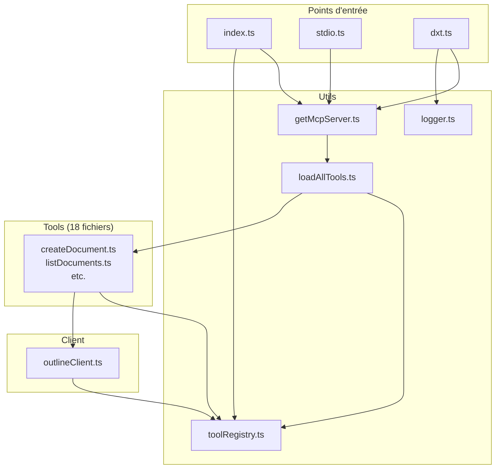

# Composants

Ce document détaille chaque composant du serveur Outline MCP, leurs responsabilités et leurs interactions.

---

## Vue d'ensemble des composants

Le serveur est organisé en plusieurs couches :

1. **Couche Transport** : Gestion des protocoles de communication (HTTP, SSE, STDIO)
2. **Couche MCP** : Implémentation du protocole MCP (serveur, registre, chargeur)
3. **Couche Outils** : 18 outils MCP exposés aux clients
4. **Couche Client** : Communication avec l'API Outline externe
5. **Couche Utilitaires** : Helpers partagés (logger, contexte)

---

## 1. Couche Transport

### 1.1. Serveur HTTP/SSE (`src/index.ts`)

**Fichier** : `/src/index.ts`
**Technologies** : Fastify 5.4.0
**Port** : Configurable via `OUTLINE_MCP_PORT` (défaut : 6060)
**Host** : Configurable via `OUTLINE_MCP_HOST` (défaut : 127.0.0.1)

#### Responsabilités

- Démarrer un serveur HTTP Fastify
- Exposer des endpoints pour les protocoles MCP (S-HTTP et SSE legacy)
- Extraire l'API key des headers ou de l'environnement
- Gérer le cycle de vie des connexions (stateless pour S-HTTP)

#### Endpoints exposés

| Méthode | Route | Protocole | Description |
|---------|-------|-----------|-------------|
| `POST` | `/mcp` | S-HTTP | Endpoint moderne MCP (Streamable HTTP) |
| `GET` | `/mcp` | - | Erreur 405 (méthode non autorisée) |
| `DELETE` | `/mcp` | - | Erreur 405 (méthode non autorisée) |
| `GET` | `/sse` | SSE | Endpoint legacy SSE (déprécié) |
| `POST` | `/messages` | SSE | Endpoint de messages SSE (déprécié) |

#### Flux d'une requête S-HTTP

```typescript
// /src/index.ts:54-84
app.post('/mcp', async (request, reply) => {
  try {
    // 1. Extraire l'API key (headers ou env)
    setupRequestContext(request);

    // 2. Créer un serveur MCP frais (stateless)
    const mcpServer = await getMcpServer();

    // 3. Créer un transport S-HTTP
    const httpTransport = new StreamableHTTPServerTransport({
      sessionIdGenerator: undefined,
    });

    // 4. Cleanup à la fermeture
    reply.raw.on('close', () => {
      httpTransport.close();
      mcpServer.close();
      RequestContext.resetInstance(); // IMPORTANT: nettoyage
    });

    // 5. Connecter le transport au serveur MCP
    await mcpServer.connect(httpTransport);

    // 6. Traiter la requête
    await httpTransport.handleRequest(request.raw, reply.raw, request.body);
  } catch (error: any) {
    // 7. Gestion d'erreur avec format JSON-RPC
    reply.code(500).send({
      jsonrpc: '2.0',
      error: { code: -32603, message: error.message },
      id: null,
    });
  }
});
```

#### Extraction de l'API key

```typescript
// /src/index.ts:11-19
function extractApiKey(request: any): string | undefined {
  const headers = request.headers;
  return (
    headers['x-outline-api-key'] ||      // Priorité 1
    headers['outline-api-key'] ||        // Priorité 2
    headers['authorization']?.replace(/^Bearer\s+/i, '') // Priorité 3
  );
}
```

**Ordre de priorité** :
1. Header `x-outline-api-key`
2. Header `outline-api-key`
3. Header `authorization` (avec extraction du token Bearer)
4. Variable d'environnement `OUTLINE_API_KEY` (fallback)

#### Mode SSE (legacy, stateful)

**⚠️ Déprécié** : Maintenu pour compatibilité avec d'anciens clients.

Différences avec S-HTTP :
- **Stateful** : Une seule instance de `SSEServerTransport` partagée (variable globale)
- **Bi-endpoint** : Nécessite `/sse` (GET) pour établir la connexion et `/messages` (POST) pour les messages
- **Pas de cleanup** : Le transport n'est pas réinitialisé entre les requêtes

**Recommandation** : Utiliser S-HTTP (`POST /mcp`) pour toute nouvelle intégration.

---

### 1.2. Serveur STDIO (`src/stdio.ts`)

**Fichier** : `/src/stdio.ts`
**Technologies** : `@modelcontextprotocol/sdk/server/stdio`
**Usage** : Clients locaux (Cursor, clients CLI)

#### Responsabilités

- Valider la présence de `OUTLINE_API_KEY` au démarrage
- Créer un transport STDIO pour communication stdin/stdout
- Se connecter au serveur MCP
- Logger uniquement sur stderr (spec MCP)

#### Code principal

```typescript
// /src/stdio.ts:6-17
// 1. Validation obligatoire de l'API key
if (!process.env.OUTLINE_API_KEY) {
  console.error('Error: OUTLINE_API_KEY environment variable is required for stdio mode');
  process.exit(1);
}

// 2. Créer le serveur MCP
const mcpServer = await getMcpServer();

// 3. Créer le transport STDIO
const transport = new StdioServerTransport();

// 4. Connecter et démarrer
await mcpServer.connect(transport);
console.error('Outline MCP Server running in STDIO mode'); // stderr uniquement
```

**Différences avec HTTP** :
- Pas de serveur HTTP, communication directe via les flux Unix
- API key **obligatoire** en variable d'environnement (pas de headers)
- Validation au démarrage (fail-fast)
- Pas de mode stateless (une seule session par processus)

**Utilisation typique** :
```json
// Cursor mcp.json
{
  "outline": {
    "command": "npx",
    "args": ["-y", "outline-mcp-server-stdio@latest"],
    "env": {
      "OUTLINE_API_KEY": "your_api_key_here"
    }
  }
}
```

---

### 1.3. Serveur DXT (`src/dxt.ts`)

**Fichier** : `/src/dxt.ts`
**Technologies** : STDIO + gestion d'erreurs avancée
**Usage** : Extension desktop pour Claude Desktop

#### Responsabilités

- Démarrer un serveur STDIO (comme `stdio.ts`)
- Gérer les signaux système (SIGINT, SIGTERM) pour shutdown gracieux
- Capturer les erreurs non gérées (uncaught exceptions, unhandled rejections)
- Logger avec un logger dédié (stderr uniquement)

#### Gestion d'erreurs avancée

```typescript
// /src/dxt.ts:20-39
// Erreurs non capturées
process.on('uncaughtException', (error: Error) => {
  logger.error('Uncaught exception:', error);
  process.exit(1);
});

process.on('unhandledRejection', (reason: any, promise: Promise<any>) => {
  logger.error('Unhandled rejection at:', promise, 'reason:', reason);
  process.exit(1);
});

// Signaux de terminaison
process.on('SIGINT', () => {
  logger.info('Received SIGINT, shutting down gracefully');
  process.exit(0);
});

process.on('SIGTERM', () => {
  logger.info('Received SIGTERM, shutting down gracefully');
  process.exit(0);
});
```

**Pourquoi un fichier séparé ?**
- Claude Desktop peut tuer le processus avec SIGTERM
- Les exceptions non gérées doivent être loggées proprement
- Le logger utilise stderr pour respecter la spec MCP (stdout réservé au protocole)

**Build DXT** :
Le script `/scripts/build-dxt.sh` :
1. Compile TypeScript (`npm run build`)
2. Génère un manifest DXT (`generate-dxt-manifest.js`)
3. Package le tout en fichier `.dxt` (zip)
4. Le fichier peut être double-cliqué pour installer dans Claude Desktop

---

## 2. Couche MCP

### 2.1. Factory MCP Server (`src/utils/getMcpServer.ts`)

**Fichier** : `/src/utils/getMcpServer.ts`
**Responsabilités** : Créer et configurer une instance de serveur MCP

#### Code

```typescript
// /src/utils/getMcpServer.ts:5-25
export async function getMcpServer() {
  // 1. Créer une instance de serveur MCP
  const server = new McpServer({
    name: process.env.npm_package_name || 'outline-mcp-server',
    version: process.env.npm_package_version || 'unknown',
    description: 'Outline Model Context Protocol server',
  });

  // 2. Charger et enregistrer tous les outils
  await loadAllTools(tool =>
    server.registerTool(
      tool.name,
      {
        description: tool.description,
        inputSchema: tool.inputSchema,
        outputSchema: tool.outputSchema,
      },
      tool.callback
    )
  );

  return server;
}
```

**Utilisation** :
- Appelé par chaque transport pour créer un serveur MCP frais
- En mode HTTP stateless, un nouveau serveur est créé par requête
- En mode STDIO/DXT, un seul serveur pour toute la durée de vie du processus

---

### 2.2. Chargeur d'outils (`src/utils/loadAllTools.ts`)

**Fichier** : `/src/utils/loadAllTools.ts`
**Responsabilités** : Charger dynamiquement tous les outils du répertoire `/src/tools/`

#### Code

```typescript
// /src/utils/loadAllTools.ts:9-30
export async function loadAllTools(onToolLoaded?: (tool: ToolDefinition<any, any>) => unknown) {
  // 1. Résoudre le chemin du répertoire tools
  const __filename = fileURLToPath(import.meta.url);
  const __dirname = path.dirname(__filename);
  const toolsDir = path.join(__dirname, '..', 'tools');

  // 2. Lister tous les fichiers .ts et .js
  const toolFiles = fs
    .readdirSync(toolsDir)
    .filter(file => file.endsWith('.ts') || file.endsWith('.js'));

  // 3. Importer chaque fichier (déclenche l'auto-registration)
  for (const file of toolFiles) {
    const resolved = path.resolve(toolsDir, file);
    await import(resolved);
  }

  // 4. Appeler le callback pour chaque outil enregistré
  for (const tool of toolRegistry.tools) {
    await onToolLoaded?.(tool);
  }
}
```

**Mécanisme** :
1. Lit tous les fichiers `.ts` ou `.js` dans `/src/tools/`
2. Importe chaque fichier (l'import déclenche l'exécution du toplevel)
3. Les outils s'auto-enregistrent via `toolRegistry.register()` lors de l'import
4. Appelle un callback optionnel pour chaque outil (utilisé par `getMcpServer`)

**Avantages** :
- Ajouter un outil = créer un fichier dans `/src/tools/`
- Pas besoin de modifier une liste manuelle
- Découverte automatique

**Inconvénients** :
- Dépend de l'exécution du toplevel (side-effects à l'import)
- Si un fichier ne s'enregistre pas, il sera ignoré silencieusement

---

### 2.3. Registre d'outils (`src/utils/toolRegistry.ts`)

**Fichier** : `/src/utils/toolRegistry.ts`
**Responsabilités** :
- Stocker la liste globale des outils MCP enregistrés
- Gérer le contexte de requête (API key, etc.)

#### Classe ToolRegistry

```typescript
// /src/utils/toolRegistry.ts:49-86
class ToolRegistry {
  private registry: Map<string, ToolDefinition<any, any>> = new Map();

  get tools(): ToolDefinition<any, any>[] {
    return Array.from(this.registry.values());
  }

  has(name: string): boolean {
    return this.registry.has(name);
  }

  get<Args extends ZodRawShape, Output extends ZodRawShape>(
    name: string
  ): ToolDefinition<Args, Output> | undefined {
    return this.registry.get(name);
  }

  public register<Args extends ZodRawShape, Output extends ZodRawShape>(
    name: string,
    definition: ToolDefinition<Args, Output>
  ): void {
    if (this.has(name)) {
      throw new Error(`Attempted to register duplicate tool: "${name}"`);
    }
    this.registry.set(name, definition);
  }
}

// Instance singleton globale
const toolRegistry = new ToolRegistry();
export default toolRegistry;
```

**Utilisation** :
```typescript
// Dans chaque outil
import toolRegistry from '../utils/toolRegistry.js';

toolRegistry.register('nom_outil', {
  name: 'nom_outil',
  description: '...',
  inputSchema: { /* Zod schema */ },
  callback: async (args) => { /* ... */ }
});
```

**Protection contre les doublons** : Une erreur est levée si un outil avec le même nom est enregistré deux fois.

---

#### Classe RequestContext

```typescript
// /src/utils/toolRegistry.ts:13-47
export class RequestContext {
  private static instance: RequestContext | null = null;
  private context: Map<string, any> = new Map();

  static getInstance(): RequestContext {
    if (!RequestContext.instance) {
      RequestContext.instance = new RequestContext();
    }
    return RequestContext.instance;
  }

  static resetInstance(): void {
    RequestContext.instance = null;
  }

  set(key: string, value: any): void {
    this.context.set(key, value);
  }

  get(key: string): any {
    return this.context.get(key);
  }

  clear(): void {
    this.context.clear();
  }

  getApiKey(): string | undefined {
    return this.get('apiKey');
  }

  setApiKey(apiKey: string): void {
    this.set('apiKey', apiKey);
  }
}
```

**Rôle** : Stocker des données spécifiques à chaque requête (notamment l'API key).

**Lifecycle** :
1. **HTTP stateless** : Créé au début de chaque requête, détruit à la fin via `resetInstance()`
2. **STDIO/DXT** : Créé une fois au démarrage (avec l'API key de l'env), jamais réinitialisé

**Utilisation** :
```typescript
// Dans index.ts
const context = RequestContext.getInstance();
context.setApiKey(apiKey);

// Dans outlineClient.ts
const context = RequestContext.getInstance();
const apiKey = context.getApiKey();
```

**⚠️ Attention** : En mode HTTP, oublier `resetInstance()` peut fuir l'API key d'une requête à l'autre.

---

## 3. Couche Client API

### 3.1. Client Outline (`src/outline/outlineClient.ts`)

**Fichier** : `/src/outline/outlineClient.ts`
**Technologies** : Axios 1.10.0
**Responsabilités** : Créer et gérer des clients HTTP pour l'API Outline

#### Fonctions exportées

##### `createOutlineClient(apiKey?: string)`

Crée un client Axios configuré pour l'API Outline.

```typescript
// /src/outline/outlineClient.ts:15-30
export function createOutlineClient(apiKey?: string): AxiosInstance {
  const key = apiKey || process.env.OUTLINE_API_KEY;

  if (!key) {
    throw new Error('OUTLINE_API_KEY must be provided either as parameter or environment variable');
  }

  return axios.create({
    baseURL: API_URL, // https://app.getoutline.com/api
    headers: {
      Authorization: `Bearer ${key}`,
      'Content-Type': 'application/json',
      Accept: 'application/json',
    },
  });
}
```

**Configuration** :
- Base URL : `OUTLINE_API_URL` (env) ou `https://app.getoutline.com/api` par défaut
- Authentification : Header `Authorization: Bearer {api_key}`
- Content-Type : JSON
- Accept : JSON

##### `getOutlineClient()`

Récupère un client en utilisant l'API key du contexte (priorité) ou de l'environnement.

```typescript
// /src/outline/outlineClient.ts:35-44
export function getOutlineClient(): AxiosInstance {
  const context = RequestContext.getInstance();
  const contextApiKey = context.getApiKey();

  if (contextApiKey) {
    return createOutlineClient(contextApiKey);
  }

  return createOutlineClient();
}
```

**Utilisation** :
```typescript
// Dans les outils
import { getOutlineClient } from '../outline/outlineClient.js';

const client = getOutlineClient();
const response = await client.post('/documents.create', payload);
```

##### `outlineClient` (Proxy, déprécié)

Client par défaut avec lazy loading via Proxy.

```typescript
// /src/outline/outlineClient.ts:58-67
let _defaultClient: AxiosInstance | null = null;
export const outlineClient = new Proxy({} as AxiosInstance, {
  get(target, prop) {
    if (!_defaultClient) {
      _defaultClient = getDefaultOutlineClient();
    }
    const value = _defaultClient[prop as keyof AxiosInstance];
    return typeof value === 'function' ? value.bind(_defaultClient) : value;
  },
});
```

**⚠️ Note** : Ce client est maintenu pour rétrocompatibilité. Utiliser `getOutlineClient()` dans les nouveaux outils.

---

## 4. Couche Utilitaires

### 4.1. Logger (`src/utils/logger.ts`)

**Fichier** : `/src/utils/logger.ts`
**Responsabilités** : Logger simple utilisant stderr

#### Code

```typescript
// /src/utils/logger.ts:1-17
const logger = {
  error: (message: string, ...args: any[]) => {
    console.error(`[ERROR] ${message}`, ...args);
  },
  warn: (message: string, ...args: any[]) => {
    console.error(`[WARN] ${message}`, ...args);
  },
  info: (message: string, ...args: any[]) => {
    console.error(`[INFO] ${message}`, ...args);
  },
  debug: (message: string, ...args: any[]) => {
    console.error(`[DEBUG] ${message}`, ...args);
  },
};

export default logger;
```

**Pourquoi stderr pour tout ?**
- En mode STDIO, stdout est réservé au protocole MCP
- Toute sortie sur stdout corromprait la communication
- stderr est utilisé pour les logs, conformément à la spec MCP

**Utilisation** :
```typescript
import logger from './utils/logger.js';

logger.info('Starting Outline MCP DXT Server...');
logger.error('Failed to start server:', error);
```

---

## Diagramme de dépendances



---

## Résumé des responsabilités

| Composant | Responsabilité principale | Fichier |
|-----------|--------------------------|---------|
| **Serveur HTTP/SSE** | Exposer des endpoints HTTP pour MCP | `/src/index.ts` |
| **Serveur STDIO** | Communication stdin/stdout pour clients locaux | `/src/stdio.ts` |
| **Serveur DXT** | Extension desktop avec gestion d'erreurs | `/src/dxt.ts` |
| **getMcpServer** | Factory pour créer un serveur MCP configuré | `/src/utils/getMcpServer.ts` |
| **loadAllTools** | Chargeur dynamique d'outils depuis `/src/tools/` | `/src/utils/loadAllTools.ts` |
| **ToolRegistry** | Registre global des outils MCP | `/src/utils/toolRegistry.ts` |
| **RequestContext** | Stockage de données par requête (API key) | `/src/utils/toolRegistry.ts` |
| **outlineClient** | Client HTTP pour l'API Outline | `/src/outline/outlineClient.ts` |
| **logger** | Logger simple (stderr) | `/src/utils/logger.ts` |
| **Outils (18)** | Implémentation des fonctionnalités MCP | `/src/tools/*.ts` |

---

## Prochaines étapes

Consultez les documents suivants pour approfondir :
- [03-outils.md](./03-outils.md) : Documentation détaillée des 18 outils MCP
- [04-api-outline.md](./04-api-outline.md) : Intégration avec l'API Outline
- [05-flux-donnees.md](./05-flux-donnees.md) : Diagrammes de flux détaillés
