# Flux de données

Ce document décrit les flux de données au sein du serveur Outline MCP, avec des diagrammes de séquence détaillés pour les scénarios principaux.

---

## Cycle de vie d'une requête MCP

### Vue d'ensemble

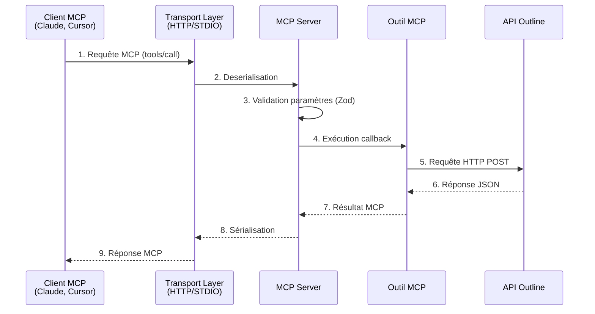

---

## Flux détaillés par mode

### 1. Mode HTTP Stateless (S-HTTP)

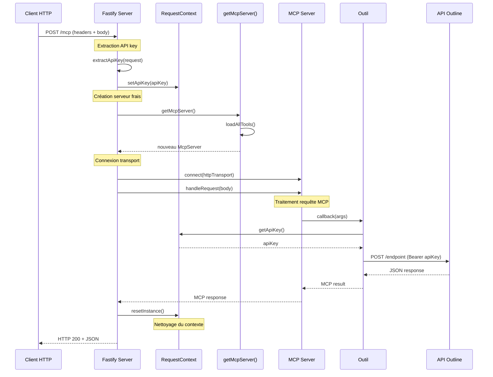

**Points clés** :
- **Stateless** : Nouveau serveur MCP créé par requête
- **Isolation** : Chaque requête a son propre `RequestContext`
- **Cleanup** : `RequestContext.resetInstance()` évite les fuites d'API key

---

### 2. Mode STDIO (Cursor, CLI)

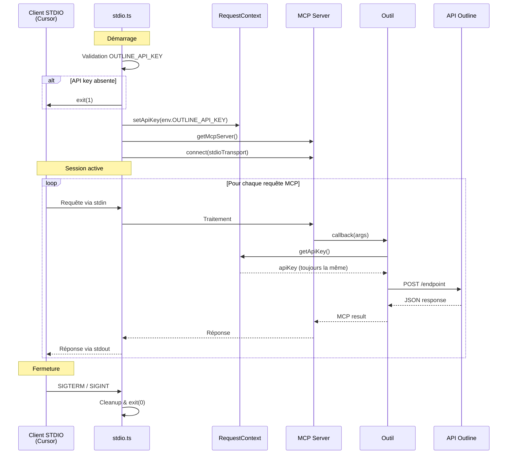

**Points clés** :
- **Stateful** : Un seul serveur MCP pour toute la session
- **API key unique** : Configurée au démarrage, jamais changée
- **Validation stricte** : Échec immédiat si API key absente
- **Stdout réservé** : Logs uniquement sur stderr (spec MCP)

---

### 3. Mode DXT (Extension Desktop)

Similaire au mode STDIO avec des ajouts :

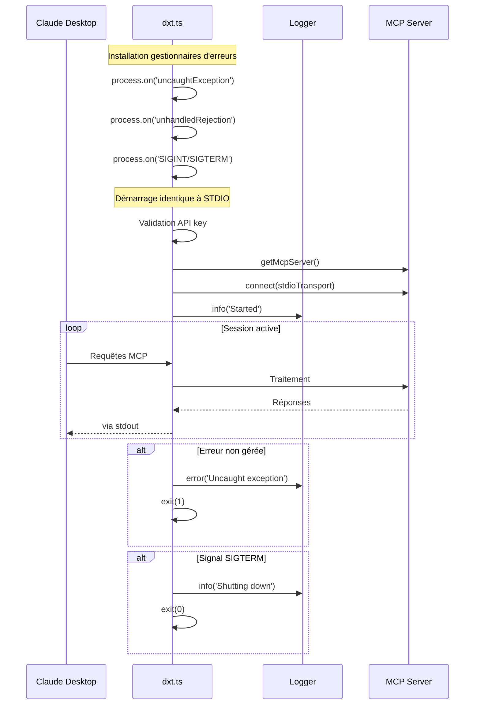

**Différences avec STDIO** :
- Gestion avancée des erreurs et signaux
- Logger dédié pour debugging
- Meilleure intégration avec Claude Desktop

---

## Flux d'authentification

### Extraction et utilisation de l'API key

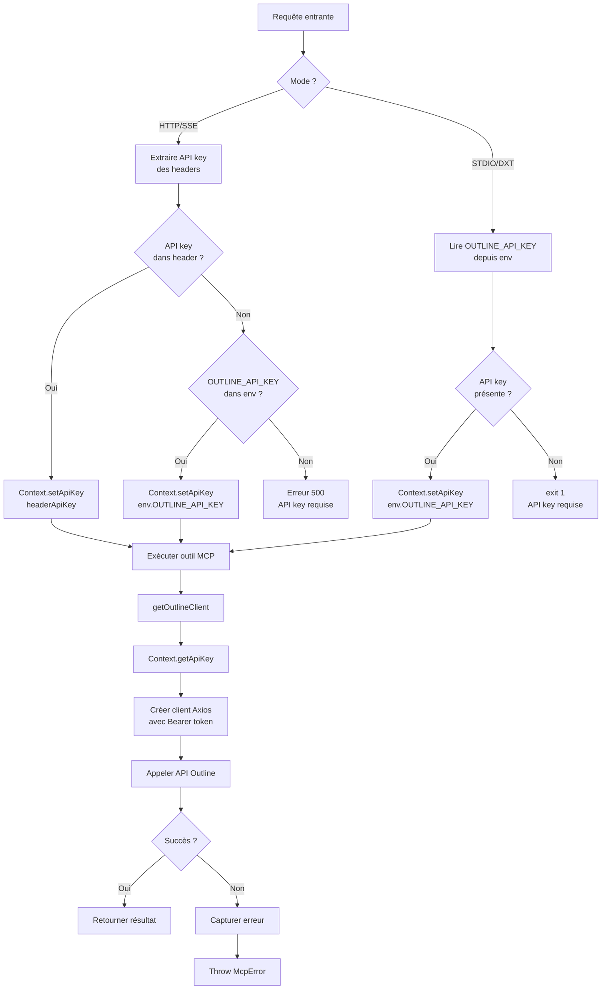

---

## Traitement d'un outil MCP

### Exemple : `create_document`

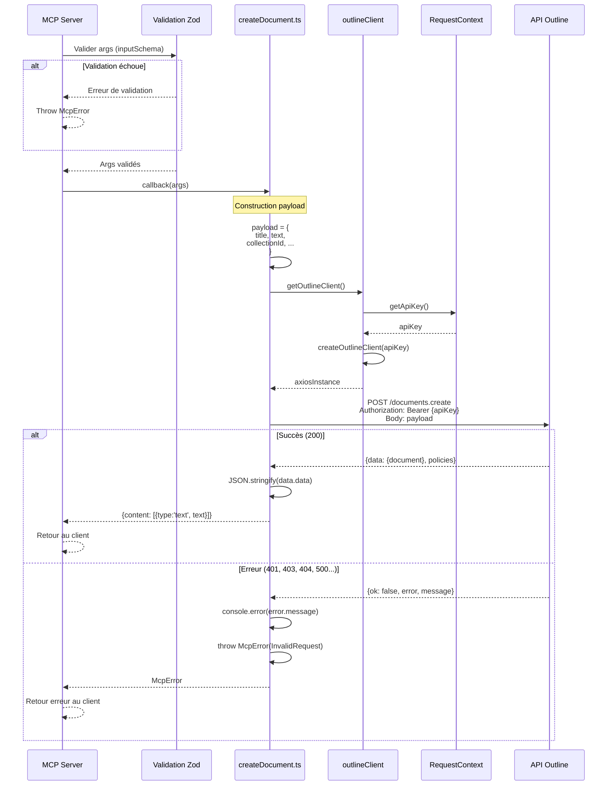

---

## Chargement dynamique des outils

### Au démarrage du serveur

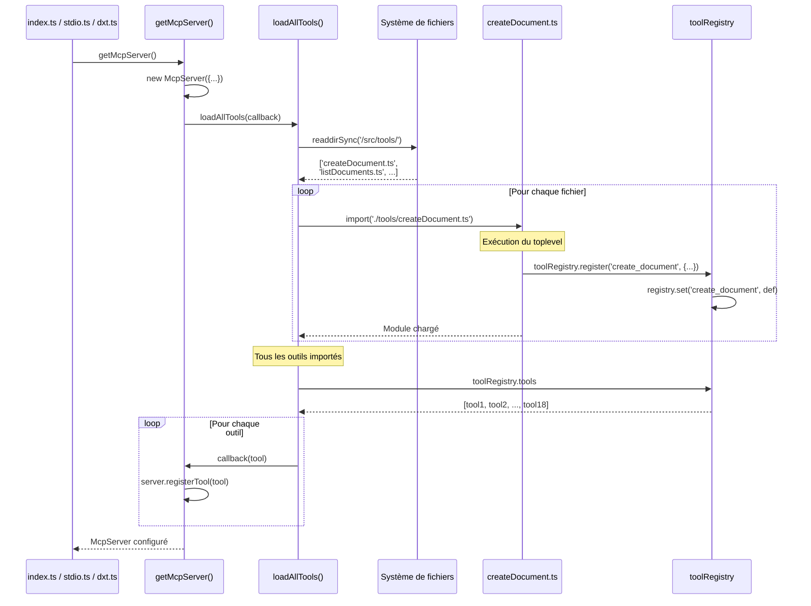

**Mécanisme d'auto-enregistrement** :
1. `loadAllTools()` importe tous les fichiers `.ts`/`.js` de `/src/tools/`
2. L'import exécute le code toplevel du fichier
3. Le toplevel appelle `toolRegistry.register()`
4. Le registre stocke la définition de l'outil
5. `loadAllTools()` parcourt le registre et enregistre chaque outil dans le serveur MCP

---

## Gestion des erreurs

### Flux d'erreur complet

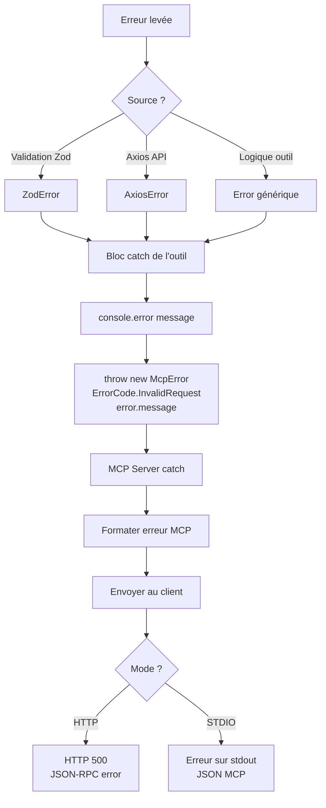

### Exemple de gestion d'erreur

```typescript
// Dans un outil
try {
  const client = getOutlineClient();
  const response = await client.post('/documents.create', payload);
  return { content: [{ type: 'text', text: JSON.stringify(response.data.data) }] };
} catch (error: any) {
  // 1. Logger l'erreur (stderr)
  console.error('Error creating document:', error.message);

  // 2. Transformer en McpError
  throw new McpError(ErrorCode.InvalidRequest, error.message);
}
```

**Types d'erreurs capturées** :
- **ZodError** : Paramètres invalides (capturé par le serveur MCP avant le callback)
- **AxiosError** : Erreurs API Outline (401, 403, 404, 500, etc.)
- **Error générique** : Erreurs de logique métier

---

## Validation des données

### Pipeline de validation

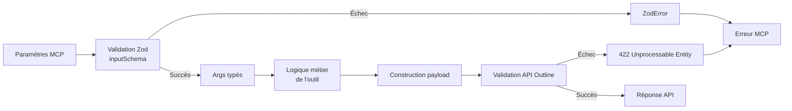

### Exemple de schéma Zod

```typescript
inputSchema: {
  title: z.string()
    .min(1, 'Le titre ne peut pas être vide')
    .describe('Titre du document'),

  text: z.string()
    .describe('Contenu du document en markdown'),

  collectionId: z.string()
    .uuid('ID de collection invalide')
    .describe('ID de la collection'),

  publish: z.boolean()
    .optional()
    .describe('Publier immédiatement'),
}
```

**Avantages** :
- Validation avant l'exécution du callback
- Messages d'erreur explicites
- Typage TypeScript automatique
- Documentation auto-générée (descriptions)

---

## Pagination et streaming

### Flux de pagination

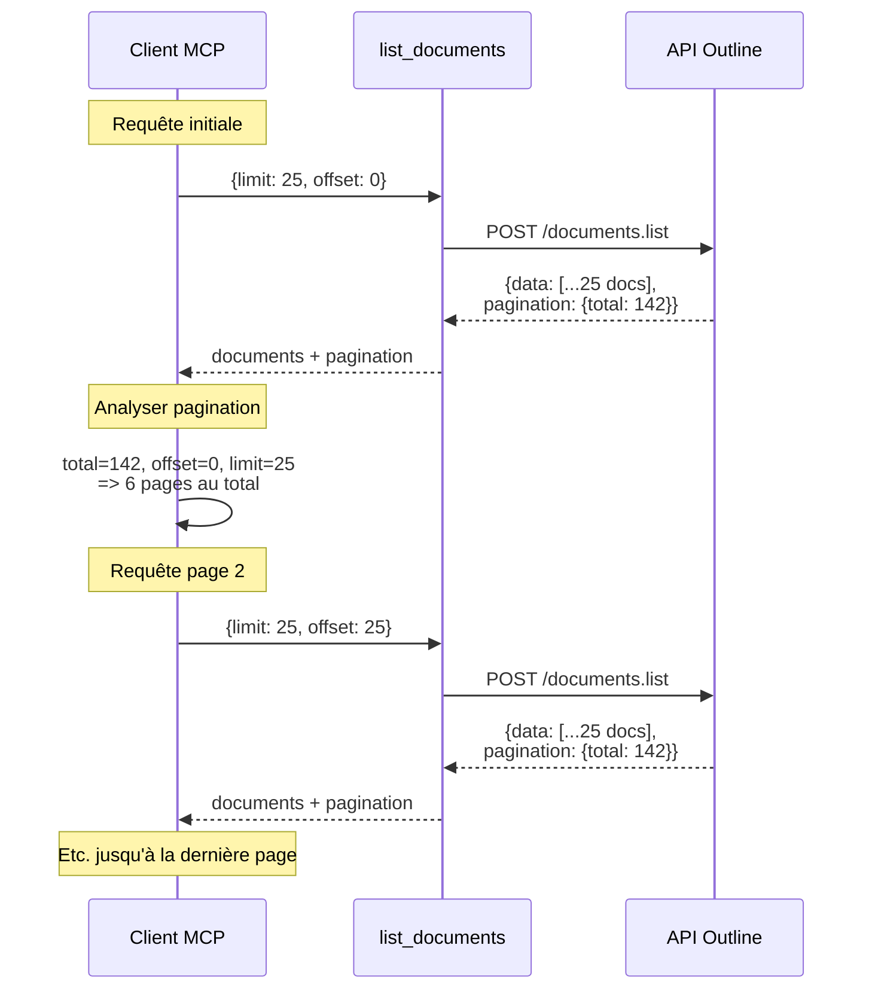

**Gestion dans les outils** :
```typescript
// list_documents.ts
return {
  content: [
    {
      type: 'text',
      text: `documents: ${JSON.stringify(documents)}`,
    },
    {
      type: 'text',
      text: `pagination: ${JSON.stringify(response.data.pagination)}`,
    },
  ],
};
```

Le client MCP peut :
1. Lire les informations de pagination
2. Calculer le nombre de pages restantes
3. Effectuer d'autres requêtes avec `offset` incrémenté

---

## Performance et optimisations

### Points de performance identifiés

| Opération | Temps estimé | Goulot d'étranglement |
|-----------|--------------|------------------------|
| **Validation Zod** | < 1ms | CPU (négligeable) |
| **Création serveur MCP** (HTTP stateless) | ~5-10ms | CPU + Imports |
| **Requête API Outline** | 100-500ms | Réseau + Traitement API |
| **Parsing JSON** | < 5ms | CPU (négligeable) |

**Optimisations possibles** :
1. **Cache de serveur MCP** : Réutiliser le serveur en mode HTTP (perdre le stateless)
2. **Cache de données** : Cacher les collections, users fréquemment demandés
3. **Batch requests** : Grouper plusieurs requêtes API en une seule
4. **Connection pooling** : Réutiliser les connexions HTTP (déjà fait par Axios)

---

## Diagramme de données

### Entités principales

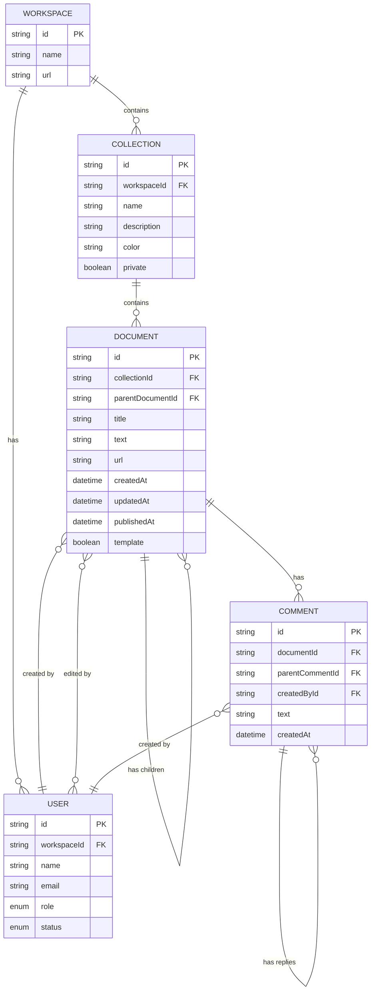

---

## Prochaines étapes

Consultez les documents suivants pour approfondir :
- [06-configuration.md](./06-configuration.md) : Configuration et variables d'environnement
- [07-deploiement.md](./07-deploiement.md) : Déploiement et build
- [08-developpement.md](./08-developpement.md) : Guide de développement
