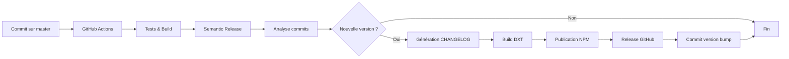
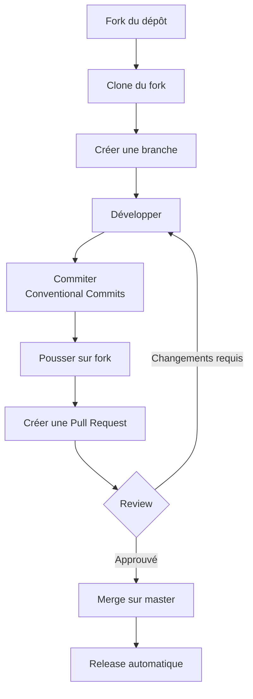

# Maintenance et évolution

Ce document décrit les processus de maintenance, de versionnement, les conventions de contribution et les pistes d'amélioration du projet.

---

## Versionnement sémantique

Le projet utilise **Semantic Versioning 2.0.0** (SemVer) avec releases automatiques via **semantic-release**.

### Format de version

```
MAJOR.MINOR.PATCH

Exemple : 5.6.0
```

| Composant | Signification | Incrémenté quand... |
|-----------|---------------|---------------------|
| **MAJOR** | Changements incompatibles | Breaking changes (ex: 5.6.0 → 6.0.0) |
| **MINOR** | Nouvelles fonctionnalités | Nouvelles features compatibles (ex: 5.6.0 → 5.7.0) |
| **PATCH** | Corrections de bugs | Bug fixes compatibles (ex: 5.6.0 → 5.6.1) |

### Détermination automatique de la version

La version est déterminée automatiquement par **semantic-release** en analysant les commits :

| Type de commit | Incrémentation |
|----------------|----------------|
| `feat(...)` | MINOR (+0.1.0) |
| `fix(...)` | PATCH (+0.0.1) |
| `BREAKING CHANGE:` | MAJOR (+1.0.0) |
| `docs(...)`, `chore(...)`, etc. | Aucune (pas de release) |

**Exemple** :
```bash
# Version actuelle : 5.6.0

git commit -m "feat(tools): add document archiving"
# → Prochaine version : 5.7.0

git commit -m "fix(auth): handle expired tokens"
# → Prochaine version : 5.7.1

git commit -m "feat(api): change auth method\n\nBREAKING CHANGE: API key format changed"
# → Prochaine version : 6.0.0
```

---

## Processus de release

### Workflow automatique



**Fichier** : `.github/workflows/npm-publish-and-release.yml`

**Étapes** :
1. **Checkout** : Clone du dépôt avec historique complet
2. **Setup Node.js** : Installation de Node.js 18.x
3. **Install dependencies** : `npm ci`
4. **Build** : `npm run build`
5. **Semantic Release** :
   - Analyse des commits (Conventional Commits)
   - Détermination de la nouvelle version
   - Génération des release notes
   - Mise à jour de `CHANGELOG.md`
   - Build de l'extension DXT (`build-all-assets.js`)
   - Publication sur NPM (`@semantic-release/npm`)
   - Création de la release GitHub avec assets (`@semantic-release/github`)
   - Commit de `package.json` et `CHANGELOG.md` (`@semantic-release/git`)

**Déclenchement** : Automatique à chaque push sur `master`

---

### Releases manuelles (urgence)

En cas de besoin urgent (hotfix), il est possible de faire une release manuelle :

```bash
# 1. Vérifier la branche
git checkout master
git pull origin master

# 2. Vérifier les commits depuis la dernière version
git log $(git describe --tags --abbrev=0)..HEAD --oneline

# 3. Lancer semantic-release manuellement
npx semantic-release --no-ci

# 4. Vérifier la publication
npm view outline-mcp-server version
```

---

## Conventions de commit

Le projet utilise **Conventional Commits** pour standardiser les messages de commit.

### Format

```
<type>(<scope>): <subject>

[body optionnel]

[footer optionnel]
```

### Types

| Type | Description | Incrémentation |
|------|-------------|----------------|
| `feat` | Nouvelle fonctionnalité | MINOR |
| `fix` | Correction de bug | PATCH |
| `docs` | Documentation uniquement | - |
| `style` | Formatage, style (pas de changement de code) | - |
| `refactor` | Refactoring (ni feature ni fix) | - |
| `perf` | Amélioration de performance | PATCH |
| `test` | Ajout ou correction de tests | - |
| `build` | Changements du build ou dépendances | - |
| `ci` | Changements de la CI | - |
| `chore` | Autres changements (maintenance) | - |
| `revert` | Annulation d'un commit précédent | - |

### Scopes recommandés

| Scope | Description |
|-------|-------------|
| `tools` | Outils MCP (créer/modifier un outil) |
| `api` | Client API Outline |
| `auth` | Authentification |
| `transport` | Couche transport (HTTP, STDIO, DXT) |
| `dxt` | Extension DXT |
| `build` | Build et packaging |
| `ci` | CI/CD |
| `docs` | Documentation |

### Exemples

```bash
# Nouvelle fonctionnalité
git commit -m "feat(tools): add support for document templates"

# Correction de bug
git commit -m "fix(auth): handle expired API tokens properly

The server now catches 401 errors and retries with a refreshed token."

# Breaking change
git commit -m "feat(api): change authentication method

BREAKING CHANGE: API key format has changed from 'api_' to 'ol_api_'.
Users must regenerate their API keys from Outline settings."

# Documentation
git commit -m "docs(readme): update installation instructions"

# Refactoring
git commit -m "refactor(tools): extract common validation logic"
```

---

## Changelog

Le fichier `CHANGELOG.md` est généré automatiquement par semantic-release.

### Format

```markdown
# [5.7.0](https://github.com/mmmeff/outline-mcp-server/compare/v5.6.0...v5.7.0) (2025-01-15)

### Features

* **tools:** add support for document templates ([abc123f](https://github.com/...))
* **api:** improve error handling ([def456a](https://github.com/...))

### Bug Fixes

* **auth:** handle expired API tokens properly ([ghi789b](https://github.com/...))
```

**Sections générées** :
- **Features** : Commits `feat(...)`
- **Bug Fixes** : Commits `fix(...)`
- **Performance Improvements** : Commits `perf(...)`
- **BREAKING CHANGES** : Commits avec footer `BREAKING CHANGE:`

---

## Contribution

### Workflow de contribution



### Checklist de contribution

Avant de soumettre une PR :

- [ ] **Code formaté** : `npm run format`
- [ ] **Build réussi** : `npm run build`
- [ ] **Tests manuels effectués** : Tester avec l'inspector MCP
- [ ] **Documentation mise à jour** : Si ajout de fonctionnalité
- [ ] **Commits conventionnels** : Format `type(scope): subject`
- [ ] **PR title conventionnel** : Format `type(scope): description`
- [ ] **Aucun secret commité** : Vérifier `.env`, API keys

### Guide de contribution

Voir le fichier [CONTRIBUTING.md](../CONTRIBUTING.md) pour les détails complets.

**Résumé** :
1. Fork le projet
2. Créer une branche : `git checkout -b feature/ma-fonctionnalite`
3. Développer et commiter : `git commit -m "feat(tools): add ..."`
4. Pousser : `git push origin feature/ma-fonctionnalite`
5. Créer une PR sur GitHub
6. Répondre aux reviews
7. Une fois approuvé, la PR est mergée et une release automatique est déclenchée

---

## Pistes d'amélioration

### 1. Tests automatisés

**Priorité** : 🔴 Haute

**Problème** : Aucune suite de tests automatisés actuellement.

**Solution proposée** :
- Ajouter Vitest pour les tests unitaires et d'intégration
- Implémenter des tests pour chaque outil MCP
- Ajouter un workflow GitHub Actions pour exécuter les tests
- Objectif de coverage : 80%

**Fichiers à créer** :
- `vitest.config.ts`
- `tests/unit/**/*.test.ts`
- `tests/integration/**/*.test.ts`
- `.github/workflows/test.yml`

**Références** :
- [09-tests.md](./09-tests.md) : Détails des tests

---

### 2. Gestion du rate limiting

**Priorité** : 🟡 Moyenne

**Problème** : Aucune gestion du rate limiting de l'API Outline.

**Solution proposée** :
- Implémenter un système de retry avec backoff exponentiel
- Ajouter un rate limiter côté client (ex: `bottleneck`)
- Détecter les erreurs 429 et attendre avant de réessayer

**Exemple** :
```typescript
import Bottleneck from 'bottleneck';

const limiter = new Bottleneck({
  maxConcurrent: 5,
  minTime: 200 // 200ms entre chaque requête
});

export async function rateLimitedPost(url: string, data: any) {
  return limiter.schedule(() => client.post(url, data));
}
```

---

### 3. Cache des données

**Priorité** : 🟡 Moyenne

**Problème** : Chaque appel à `list_collections` ou `list_users` fait une requête API.

**Solution proposée** :
- Implémenter un cache en mémoire avec TTL
- Cacher les collections (rarement modifiées)
- Cacher les utilisateurs (rarement modifiés)
- Invalider le cache sur webhooks Outline

**Exemple** :
```typescript
import NodeCache from 'node-cache';

const cache = new NodeCache({ stdTTL: 300 }); // 5 minutes

export async function getCachedCollections() {
  const cached = cache.get('collections');
  if (cached) return cached;

  const response = await client.post('/collections.list', {});
  cache.set('collections', response.data.data);
  return response.data.data;
}
```

---

### 4. Support des webhooks Outline

**Priorité** : 🟢 Basse

**Problème** : Aucun support pour les webhooks Outline (notifications de changements).

**Solution proposée** :
- Ajouter un endpoint POST `/webhooks/outline`
- Valider les signatures des webhooks
- Invalider le cache sur événements pertinents
- Exposer des outils MCP pour s'abonner aux événements

---

### 5. Opérations batch

**Priorité** : 🟢 Basse

**Problème** : Chaque opération nécessite un appel séparé.

**Solution proposée** :
- Créer des outils `batch_create_documents`, `batch_delete_documents`
- Limiter les requêtes concurrentes (rate limiting)
- Retourner un résumé des succès/échecs

**Exemple** :
```typescript
toolRegistry.register('batch_create_documents', {
  name: 'batch_create_documents',
  description: 'Create multiple documents in batch',
  inputSchema: {
    documents: z.array(z.object({
      title: z.string(),
      text: z.string(),
      collectionId: z.string(),
    }))
  },
  async callback(args) {
    const results = await Promise.allSettled(
      args.documents.map(doc => client.post('/documents.create', doc))
    );
    // Retourner résumé
  }
});
```

---

### 6. Output schemas Zod

**Priorité** : 🟢 Basse

**Problème** : Aucun schéma de validation pour les réponses des outils.

**Solution proposée** :
- Ajouter des `outputSchema` Zod pour chaque outil
- Valider les réponses de l'API Outline
- Garantir un format de sortie cohérent

**Exemple** :
```typescript
toolRegistry.register('get_document', {
  name: 'get_document',
  inputSchema: { /* ... */ },
  outputSchema: {
    id: z.string(),
    title: z.string(),
    text: z.string(),
    url: z.string(),
    createdAt: z.string(),
    updatedAt: z.string(),
  },
  async callback(args) { /* ... */ }
});
```

---

### 7. Métriques et monitoring

**Priorité** : 🟢 Basse

**Problème** : Aucune métrique sur l'utilisation du serveur.

**Solution proposée** :
- Ajouter un système de métriques (ex: `prom-client` pour Prometheus)
- Exposer un endpoint `/metrics`
- Tracker :
  - Nombre de requêtes par outil
  - Temps de réponse par outil
  - Erreurs par type
  - Nombre de requêtes API Outline

---

### 8. Multi-workspace support

**Priorité** : 🟢 Basse

**Problème** : Un serveur ne peut se connecter qu'à un seul workspace Outline.

**Solution proposée** :
- Permettre de configurer plusieurs API keys
- Ajouter un paramètre `workspace` aux outils
- Router les requêtes vers le bon workspace

---

## Éléments dépréciés

### 1. Transport SSE (legacy)

**Fichier** : `/src/index.ts:109-150`

**Statut** : ⚠️ Déprécié, maintenu pour compatibilité

**Raison** : Remplacé par Streamable HTTP (S-HTTP), protocole MCP moderne.

**Migration** :
- Utiliser `POST /mcp` au lieu de `GET /sse` + `POST /messages`
- Passer au mode stateless

**Suppression prévue** : Version 7.0.0 (estimation)

---

### 2. Client Outline par défaut (Proxy)

**Fichier** : `/src/outline/outlineClient.ts:58-67`

**Statut** : ⚠️ Déprécié, utilisez `getOutlineClient()`

**Raison** : Le Proxy lazy-loading est complexe et peu utile.

**Migration** :
```typescript
// ❌ Ancien (déprécié)
import { outlineClient } from '../outline/outlineClient.js';
const response = await outlineClient.post('/endpoint', {});

// ✅ Nouveau (recommandé)
import { getOutlineClient } from '../outline/outlineClient.js';
const client = getOutlineClient();
const response = await client.post('/endpoint', {});
```

---

## Surveillance et monitoring

### Logs

**Emplacement** :
- **Développement** : Console (stderr)
- **Production systemd** : `journalctl -u outline-mcp -f`
- **Production Docker** : `docker logs -f outline-mcp-server`

**Niveaux de log** :
```typescript
logger.error('Critical error:', error);  // Erreurs critiques
logger.warn('Warning:', message);        // Avertissements
logger.info('Server started');           // Informations
logger.debug('Debug info:', data);       // Debug (non utilisé actuellement)
```

---

### Healthcheck

**HTTP** :
```bash
curl -X POST http://localhost:6060/mcp
# Attendu : Erreur 405 (serveur répond)
```

**Docker** :
```yaml
healthcheck:
  test: ["CMD", "wget", "--quiet", "--tries=1", "--spider", "http://localhost:6060/mcp"]
  interval: 30s
  timeout: 10s
  retries: 3
```

---

### Alertes recommandées

| Alerte | Condition | Action |
|--------|-----------|--------|
| **Serveur down** | Healthcheck échoue 3 fois | Redémarrer le serveur |
| **Erreurs API** | > 10 erreurs 401/403/500 en 5min | Vérifier API key et permissions |
| **Rate limiting** | Erreurs 429 fréquentes | Réduire le nombre de requêtes |
| **Latence élevée** | Temps de réponse > 5s | Investiguer performance API Outline |

---

## Dépendances

### Mise à jour des dépendances

```bash
# Vérifier les dépendances obsolètes
npm outdated

# Mettre à jour les dépendances mineures/patch
npm update

# Mettre à jour une dépendance spécifique
npm install @modelcontextprotocol/sdk@latest

# Vérifier les vulnérabilités
npm audit

# Corriger les vulnérabilités automatiquement
npm audit fix
```

### Dépendances critiques

| Package | Rôle | Version actuelle | Fréquence de mise à jour |
|---------|------|------------------|--------------------------|
| `@modelcontextprotocol/sdk` | SDK MCP officiel | 1.13.1 | Mensuelle |
| `axios` | Client HTTP | 1.10.0 | Mensuelle |
| `fastify` | Serveur HTTP | 5.4.0 | Mensuelle |
| `zod` | Validation | 3.25.67 | Bimensuelle |
| `typescript` | Compilateur | 5.x | Mensuelle |

**Recommandation** : Mettre à jour mensuellement, tester en staging avant production.

---

## Support et contact

### Canaux de support

- **Issues GitHub** : https://github.com/mmmeff/outline-mcp-server/issues
- **Discussions GitHub** : https://github.com/mmmeff/outline-mcp-server/discussions
- **Documentation** : https://github.com/mmmeff/outline-mcp-server/tree/master/docs

### Signaler un bug

**Template d'issue** :

```markdown
**Description**
Brève description du bug.

**Reproduction**
Étapes pour reproduire :
1. Configurer avec...
2. Lancer avec...
3. Appeler l'outil...
4. Voir l'erreur

**Comportement attendu**
Ce qui devrait se passer.

**Comportement actuel**
Ce qui se passe réellement.

**Environnement**
- OS : [Linux/macOS/Windows]
- Node.js : [version]
- Mode : [HTTP/STDIO/DXT]
- Version du serveur : [5.6.0]

**Logs**
```
[coller les logs pertinents]
```
```

---

## Roadmap

### Version 6.0 (Q2 2025)

- [ ] Tests automatisés (Vitest)
- [ ] Support du rate limiting
- [ ] Cache des collections et utilisateurs
- [ ] Breaking change : Suppression du transport SSE legacy

### Version 7.0 (Q4 2025)

- [ ] Support des webhooks Outline
- [ ] Opérations batch
- [ ] Multi-workspace support
- [ ] Métriques et monitoring (Prometheus)

### Version 8.0 (2026)

- [ ] Support du streaming pour les gros documents
- [ ] Offline mode avec synchronisation
- [ ] Plugin system pour étendre les fonctionnalités

---

## Prochaines étapes

Vous avez maintenant une vue complète du projet. Pour aller plus loin :

- [README principal](../README.md) : Vue d'ensemble du projet
- [01-architecture.md](./01-architecture.md) : Comprendre l'architecture
- [08-developpement.md](./08-developpement.md) : Contribuer au projet
- [CONTRIBUTING.md](../CONTRIBUTING.md) : Guide de contribution officiel
